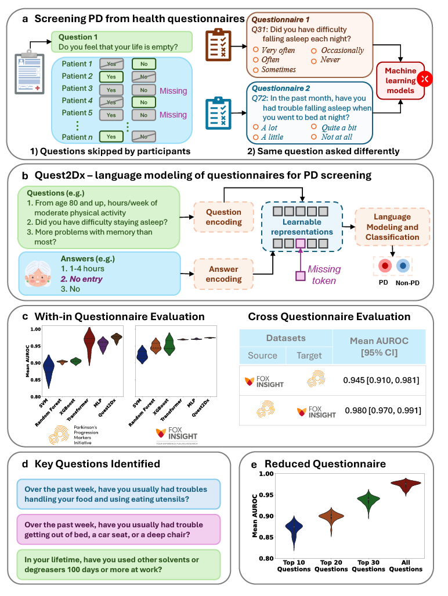

# Quest2Dx

This repository contains our demo code to run inference (predict) if an individual is likely to have PD or not from self-reported questionnaire data.

  
**a.** Self-reported data often contains large volumes of missing entries which makes it very challenging for its analysis. At the same time, health-questionnaires might ask similar questions; however with different wording or options. This limits the applicability of machine learning models across questionnaires.  
**b.** Quest2Dx uses language modeling to incorporate knowledge from the questions together with the answers given by the patients. It also learns a missing-entry data representation to model the missing answers.  
**c.** Quest2Dx effectively classifies PD patients from healthy controls on two datasets. Quest2Dx is also able to be trained on one questionnaire and be evaluated on a different one. Violin plot shows the average area under the receiver operating characteristic curve (AUROC) for Quest2Dx and comparison models. Quartiles are shown inside the violin plots.  
**d.** Quest2Dx is highly interpretable as it is able to identify the questions driving the classification.  
**e.** A targeted dataset of the top 30 questions identified by Quest2Dx showed strong performances to classify PD patients.

---

## 📦 Repository Structure

```plaintext
.
├── src/                      # core library code
├── .gitignore                # files and folders to ignore
├── README.md                 # this file
├── demo_inference.py         # command-line demo script
├── demo_inference.ipynb      # interactive Jupyter demo
├── graph_abs.pdf             # original PDF of the graphical abstract
└── quest2dx_env.yml          # conda environment spec
```
---

## 🔨 Create the conda environment

Make sure you have [conda](https://docs.conda.io/) installed, then run:

```bash
# 1) Create the environment from the spec
conda env create -f quest2dx_env.yml

# 2) Activate it
conda activate quest2dx

# (Optional) Install in editable mode to import from src/
pip install -e src
```

▶️ Run the demo

# Show available options
``` bash
python demo_inference.py --help
```
``` bash
jupyter notebook demo_inference.ipynb
```
---

Note that, due to privacy limitations data cannot be publicly shared.

Please refer to our manuscript for further details: https://www.medrxiv.org/content/10.1101/2024.09.23.24314200v1.full-text
